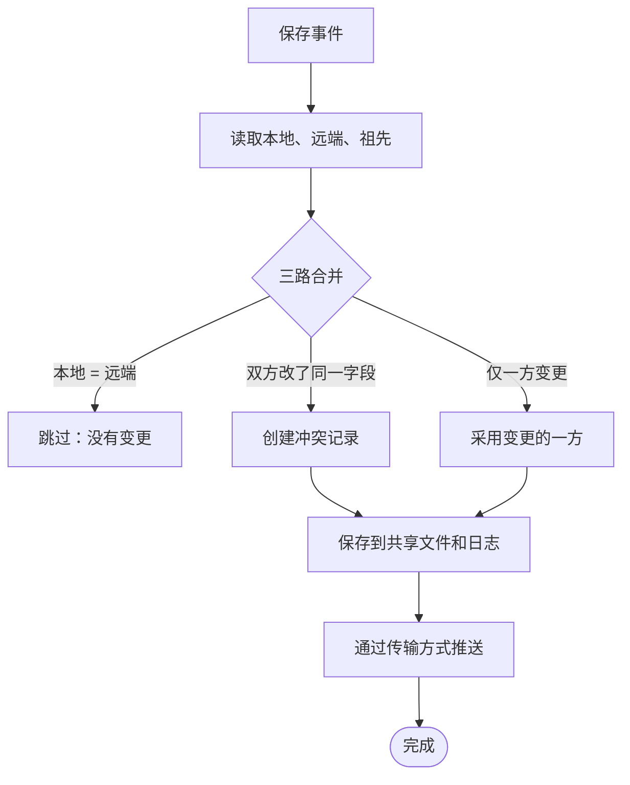
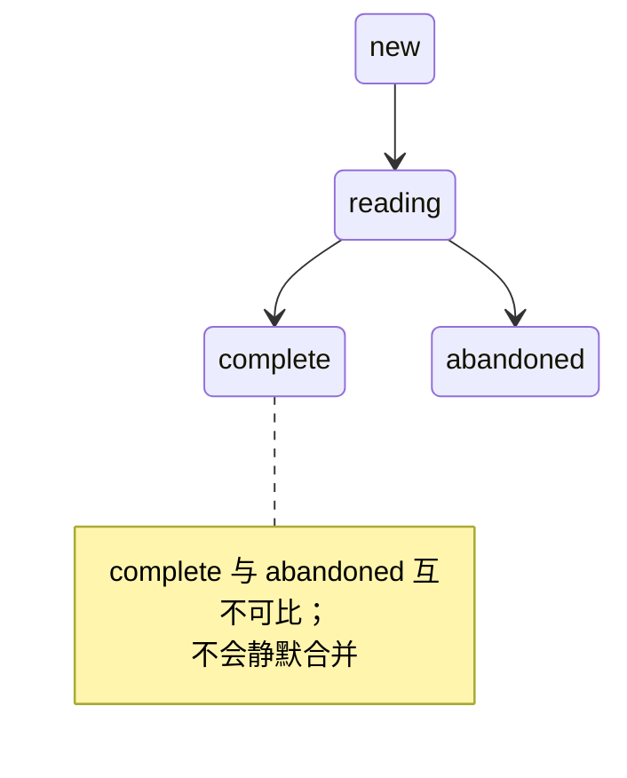

<div align="center">


[](https://github.com/9990ex/syncery.koplugin.sc/releases)
[](LICENSE)

**适用于 KOReader 的跨设备阅读进度、批注、元数据和渲染设置同步。**

Syncery 会通过 Syncthing 或云存储（Dropbox/WebDAV/FTP），在你的所有 KOReader 设备之间同步每台设备的阅读数据。

**第一次使用？** 请从 **[设置与同步指南](SETUP.md)** 开始，了解如何从零配置 Syncthing 或云同步。

</div>

> 本仓库是 [d0nizam/syncery.koplugin](https://github.com/d0nizam/syncery.koplugin) 的非官方简体中文 fork。
> 上游基线为 v1.2.4.1；本仓库版本为 v1.2.4.1.1。功能、原始版权与许可证均保留。

---

## 目录

- **[设置与同步指南](SETUP.md)**：首次配置请从这里开始
- [功能](#功能)
- [支持的设备](#支持的设备)
- [安装](#安装)
- [首次设置](#首次设置)
- [存储模式](#存储模式)
- [Syncery 同步的内容](#syncery-同步的内容)
- [菜单参考](#菜单参考)
- [传输方式](#传输方式)
- [冲突解决](#冲突解决)
- [生命周期事件](#生命周期事件)
- [翻译](#翻译)
- [设置参考](#设置参考)
- [架构概览](#架构概览)
- [故障排除](#故障排除)
- [致谢](#致谢)
- [另请参阅](#另请参阅)
- [许可证](#许可证)

---

## 功能

Syncery 可让你在每台 KOReader 设备上的阅读状态保持一致。它可自行托管，不需要账号，也不经过第三方服务器。

- **阅读位置**：在一台设备开始阅读，在另一台设备从上次位置继续。其他设备读得更靠后时，Syncery 可按你的选择自动跳转、先询问或永不跳转。
- **高亮、笔记和书签**：批注会随设备同步；删除的批注会进入可恢复的**回收站**。
- **图书详情**：阅读状态（阅读中/搁置/已读完）、星级、书单、摘要笔记、自定义标题或作者、手工目录都会同步。
- **字体和版式**：可选同步每本书的字体和页边距；默认关闭，因为手机适合的字号通常不适合大屏电子书设备。
- **文件由你掌控，传输由你选择**：全部数据以纯 JSON 通过 **Syncthing**（设备直连）或你自己的**云端**（Dropbox/WebDAV/FTP）传输。
- **设备意见不同时不丢数据**：不同设备的编辑会合并而不是互相覆盖。唯一真正可能冲突的情况是一本书在一台设备被标为*已读完*、另一台标为*搁置*；Syncery 会交给你解决，绝不悄悄丢弃。
- **支持离线**：设备重新连接后才同步；离线数周的设备仍会保留位置。
- **全书库立即同步**：一次操作推送和拉取所有有待同步变更的书，而不仅是当前打开的书；还能发现你在其他设备同步但本机从未打开的书，预取其进度和批注。
- **阅读统计和词汇表**：可按同一周期触发 KOReader 内置的阅读统计与生词本插件，通过云存储同步它们自己的数据库。Syncery 只触发同步，合并由这些插件自行处理。
- **集中查看**：**进度浏览器**展示每本书在每台设备上的阅读进度，可跳到任一设备的位置或返回本机上次位置；**批注浏览器**汇集整个书库的高亮和笔记。

字段和开关见[Syncery 同步的内容](#syncery-同步的内容)，实现方式见[架构概览](#架构概览)。

---

## 支持的设备

任何运行较新版本 KOReader 的设备均可使用。

Syncery 将 JSON 写入磁盘，本身不运行守护进程。数据复制由传输方式（Syncthing 或云端）负责，因此任何能够运行 KOReader 和其中一种传输方式的设备都可参与。

---

## 安装

### 手动 ZIP 安装

1. 从[发布页](../../releases)下载最新 `syncery.koplugin.zip`。
2. 将 `syncery.koplugin/` 解压到 KOReader 的插件目录：

   | 设备 | 插件目录 |
   |---|---|
   | Kobo | `/mnt/onboard/.adds/koreader/plugins/` |
   | Kindle | `/mnt/us/koreader/plugins/` |
   | Android | `/koreader/plugins/` |

3. 重启 KOReader；在 **☰ -> 工具** 中会出现 **Syncery**。

### 更新

打开 **Syncery -> 检查插件更新**。它会在本仓库检查新发布版、显示更新说明、原地安装并提供重启选项。

### 依赖项

插件本身除 KOReader 外没有运行时依赖；各传输方式需要各自后端：

- **Syncthing**：运行中的 Syncthing 守护进程及 REST API 访问权限（可通过 KOSyncthing+、其他 Syncthing 插件；Android 设备还可使用 Syncthing Android 应用）。
- **云端**：启用 KOReader 的“Cloud storage+”插件，并配置 Dropbox、WebDAV 或 FTP 服务。

---

## 首次设置

首次加载会自动打开向导，以一个居中的面板完成最多五步。

### 1 - 选择传输方式

选择本设备如何同步：**Syncthing**（点对点）、**云端**（请求-响应，Dropbox/WebDAV/FTP），或**稍后决定**（先只在本地保存数据，之后再选）。若已安装 KOSyncthing+，Syncthing 项会提供自动发现。

### 2 - 输入 API 密钥（仅 Syncthing）

如果选择 Syncthing 且未使用 KOSyncthing+，会弹出 `InputDialog` 要求输入 Syncthing REST API 密钥；否则跳过此步骤。

### 3 - 选择同步内容

切换**进度**和**批注**。两者默认关闭，只有你明确开启后才会同步。更细的元数据、渲染设置、批注子开关在设置完成后的“同步哪些内容”菜单中。

### 4 - 为设备命名

设置其他设备可见的名称，例如“Kindle Paperwhite”。名称显示在状态面板及每条合并记录中。

### 5 - 检查并确认

摘要页面显示全部选择；点击**完成**保存并开始同步。

---

## 存储模式

> **SDR（默认）**
> *写入：* `<book>.sdr/<book>.syncery-annotations.json`
> *规则：* 跟随 KOReader 的“图书元数据位置”（图书侧车目录）。
> *读取：* 规范位置；并在 KOReader 的三个元数据位置（图书文件夹/docsettings/hashdocsettings）回退查找。
> *适合：* 希望 Syncery 跟随现有 KOReader 设置的用户。
>
> **Synceryhash**
> *写入：* `<settings>/syncery/synceryhash/<shard>/<book_md5>/syncery-annotations.json`
> *规则：* 内容寻址，同一本书在每台设备路径相同。
> *读取：* 单一位置，无须回退。
> *适合：* 希望使用明确、独立同步位置的用户。
>
> **不要混淆两个“hash”概念：** *Synceryhash* 是 Syncery 存放**自身**文件的位置；KOReader 的 **hashdocsettings** 是 KOReader 保存**自身**原生 `.sdr` 的三种位置之一。使用 Synceryhash 不需要启用 hashdocsettings。
>
> **两种模式共享（私有，永不同步）：**
> * `last_sync/<book_md5>/`：三路合并使用的本机祖先版本
> * `cloud_staging/`：上传暂存
> * `sync-journal.ndjson`：合并事件日志
> * `syncery_activity.json`：最近活动记录
>
> **迁移：** 只运行一次、幂等，只移动共享文件。位置：高级 -> 存储模式。

---

## Syncery 同步的内容

| 类别 | 保存内容 | 合并策略 | 界面开关 |
|---|---|---|---|
| **阅读进度** | 每设备：`(percent, page, total_pages, xpath, revision, timestamp, device_id)` | 按 `(revision, timestamp)` 最后写入获胜 | 总开关 |
| **批注** | 高亮、笔记、书签，以及颜色、绘制方式、时间戳、device_id | 带墓碑标记的三路合并 | 总开关；高亮/笔记/书签子开关；文件扩展名过滤 |
| **图书元数据** | 阅读状态、评分、书单、摘要、自定义标题/作者、手工目录 | 每字段最后写入获胜；状态使用生命周期格 | 总开关及各字段子开关 |
| **渲染设置** | 字体、字号、行距、字重、页边距 | 每字段最后写入获胜 | 总开关（默认关闭）及字段子开关 |
| **KOReader 插件数据库** | Syncery 不携带数据库；它按周期触发阅读统计和生词本各自的云同步 | 不适用；Syncery 仅触发，插件自身合并冲突 | 统计与词汇总开关、每插件子开关、1-1440 分钟间隔、统一服务器开关 |

### 统计与词汇同步

Syncery 可定期触发 KOReader 原生**阅读统计**和**生词本**，让它们通过云端同步自己的数据库。Syncery 不读取、不携带也不合并这些 SQLite 数据库；它只是调用各插件已有的 Cloud storage+ 同步机制。每个插件自行三路合并，因此并发修改会被协调而非覆盖。

**要求：**

- 已启用 Cloud storage+（或内置 SyncService）
- 两个插件各自需要配置云服务器（Dropbox 或 WebDAV；FTP 不可用）
- Syncthing 不携带这些插件数据库；仅支持云存储

**“同步词汇和统计”中可配置的内容：**

- **总开关**：默认关闭
- **统计** / **词汇**子开关：选择触发哪个插件
- **间隔**：1-1440 分钟，默认 5 分钟
- **使用 Syncery 的云服务器**：把 Syncery 的服务器地址写入两个插件设置，只配置一次目标

**翻页行为：** 实际同步在 KOReader UI 线程同步执行，同步时翻页可能短暂卡顿。

---

## 菜单参考

Syncery 位于 **☰ -> 工具**。完整结构如下：

<details>
<summary><b>菜单树（来自源码）</b></summary>

```
Syncery                                         <- ☰ -> 工具中的顶层入口
|
|- ⚠ 阅读状态不同 - 点按解决                 <- 仅当前书跨设备状态冲突时出现
|- [智能状态标题]                               <- 单行状态摘要，最右显示当前阅读百分比
|- 同步此书                                      <- 当前有书打开时的单书同步开关
|- 立即同步
|- 同步哪些内容 ->
|  |- 阅读位置
|  |- 批注：高亮、笔记、书签；回收站
|  |- 元数据；推送本书手工目录
|  |- 字体和版式
|  |- 统计与词汇 -> 总开关、统计、词汇、使用 Syncery 云服务器、间隔、说明
|  |- 适应本设备的高亮样式
|  `- 跳转：自动跳转 / 先询问 / 从不跳转；立即跳至其他设备位置
|- 传输方式 -> 配置 Syncthing；云端设置
|- 进度浏览器                                    <- 查看每本书每台设备进度并跳转
|- 批注浏览器                                    <- 跨书查看高亮和笔记
|- 本书 -> 撤销上次跳转；仅删除批注；完全重置
|- 工具 -> 导入旧批注；管理同步图书；清理孤立文件；活动记录；Syncthing/云端维护
|- 高级 -> 存储模式；设备名称/二维码；诊断信息；详细日志；保存间隔；删除和重置
`- 检查插件更新
```

</details>

---

## 传输方式

Syncery 写入纯 JSON 文件，传输方式负责复制。支持 **Syncthing**（点对点）和**云端**（经 KOReader Cloud storage+ 或 Cloud storage 使用 Dropbox/WebDAV/FTP，并即时一致）。两者实现同一契约：`id`、`push`、`status`，由协调器以相同方式驱动。

<details>
<summary><b>各传输方式详情与比较</b></summary>

### Syncthing

通过 Syncthing REST API 的点对点加密文件复制。在**传输方式 -> 配置 Syncthing**中配置：

- **API 密钥**：保存 REST API 密钥。检测到 KOSyncthing+ 时不需要，它会提供密钥。
- **文件夹**：向守护进程读取文件夹列表后选择一个。它是图书发现扫描根目录和 `.stignore` 的放置位置。
- **主机**：固定 `127.0.0.1`；守护进程在本机运行。高级设置只暴露端口以支持非标准环境。
- **测试连接**：探测守护进程并校验密钥。
- **KOSyncthing+**：安装后自动检测 URL、API 密钥和文件夹。
- **`.stignore` 抑制**：在文件夹根目录写入 `*syncery-*sync-conflict-*`，非阻塞、幂等、合并安全，即使守护进程关闭也可写入。
- **最终一致性**：推送后即返回；守护进程异步复制。

### 云端

使用 KOReader Cloud storage+，不可用时使用 Cloud storage。在**传输方式 -> 云端设置**中配置：

- **目标位置**：选择或更改 JSON 上传位置（Dropbox/WebDAV/FTP）。
- **清除目标位置**：仅忘记本设备配置，不会删除云端文件。
- **检查云端设置**：确认已设置目标；下次同步验证可达性。
- **防抖窗口**：保存后等待多久再上传。
- **即时一致性**：上传会返回真实 HTTP 状态码。
- **暂存和上传**：先写入暂存目录，后端异步上传；后台同步时静默提示。

| 方面 | Syncthing | 云端 |
|---|---|---|
| 后端 | 本地 Syncthing 守护进程 | KOReader SyncService / Cloud storage+ |
| 传输 | REST API（HTTP/HTTPS） | WebDAV、FTP、Dropbox API 等 |
| 一致性 | 最终一致 | 即时（HTTP 响应） |
| 文件夹/目标 | 从在线列表选择 | 通过后端选择 |
| 冲突副本 | 可能有 `.sync-conflict-*` | 不会产生 |
| 认证 | API 密钥 | 后端凭据 |
| `.stignore` | 管理 `*syncery-*sync-conflict-*` | 不适用 |
| 扫描触发 | 推送后 REST 扫描 | 不适用 |
| 重试 | Policy 处理瞬时错误 | Policy 处理瞬时错误 |
| 测试 | 探测守护进程 | 检查目标设置 |

</details>

---

## 冲突解决

每次保存会读取本地、共享远端及每设备祖先版本，并做三路合并：



阅读状态是唯一可能真正冲突的字段。KOReader 用 `new` / `reading` / `complete` / `abandoned` 保存状态，后两项界面显示为**已读完**与**搁置**。`complete` 与 `abandoned` 互不可比，因此不按时间戳强合并，而是通过小型状态格处理：



<details>
<summary><b>按类别说明</b></summary>

### 批注：三路合并

每次同步比较三种视图：

1. **本地**：当前设备当前拥有的内容
2. **远端**：共享 JSON 文件中的内容
3. **祖先**：每台设备保存的上次同步文件

`merge.lua` 中的 Git 风格三路合并规则：

- 上次同步中存在、当前本地不存在：用户删除了它，保持删除。
- 上次同步和当前本地都不存在：是远端新增内容，采用。
- 双方改了同一字段：建立冲突记录，保留数据，不丢失。

### 阅读进度：最后写入获胜

每条记录含 `(revision, timestamp)`；最高 revision 获胜，timestamp 用于打破平局。条目不会被结构性删除。

### 阅读状态：生命周期格

`status_lattice.lua` 处理特殊情况：

- `new < reading < complete`：自动前进
- `new < reading < abandoned`：自动前进
- `complete ⟂ abandoned`：互不可比，通过代数计数器解决

### 冲突副本文件

Syncthing 产生 `*syncery-*sync-conflict-*` 文件时：

1. `.stignore` 阻止它们复制到其他设备。
2. 冲突解决器进行二路合并：进度以 `(revision, timestamp)` 决定；批注按条目较新者获胜；随后删除副本。
3. KOSyncthing+ 将其从冲突徽标中隐藏。

云端传输不产生冲突副本。

</details>

---

## 生命周期事件

KOReader 的关闭、挂起、恢复、关机、退出与设置刷新事件，都被路由至统一 teardown，并按场景使用合适的“强制刷盘”选项：退出和关闭最强，会关闭传输；挂起和关机只刷盘。过期定时器由 `destroyed` 标记防护。

| KOReader 事件 | 生命周期处理器 | Teardown 选项 | 行为 |
|---|---|---|---|
| `onCloseDocument` | `on_close_document()` | `{ destroying = true }` | 完整销毁式刷新：保存进度和批注、机会性云推送、延迟扫描；关闭传输 |
| `onSuspend` | `on_suspend()` | `{}` | 只刷新，不 teardown |
| `onResume` | `on_resume()` | 无 | 有界网络轮询，唤醒后重新 `checkRemote` |
| `onPowerOff` | `on_power_off()` | `{}` | 只刷新，不销毁；插件和传输继续存在 |
| `onQuit` | `on_quit()` | `{ destroying = true }` | 最强刷新并关闭传输 |
| `onFlushSettings` | `on_flush_settings()` | 无 | 有文档打开时防抖触发 Syncthing 扫描 |
| `onSaveSettings` | `on_save_settings()` | 无 | 随 KOReader 设置刷新保存 Syncery 状态 |
| `onPageUpdate` / `onPosUpdate` | `schedule_auto_save()` | 无 | 启动自动保存定时器 |

所有回调执行前检查 `destroyed`，已关闭文档遗留的定时器不会再次运行。

---

## 翻译

| 语言 | 文件 | 状态 |
|---|---|---|
| 保加利亚语 | `locale/bg.po` | 完整 |
| 俄语 | `locale/ru.po` | 完整 |
| 简体中文 | `locale/zh_CN.po` | 完整（本 fork） |
| 英语（源） | `locale/syncery.pot` | 主模板 |

模板从 Lua 源码中 `_("...")` 和 `_n("...", "...", n)` 调用生成：

```sh
python3 tools/i18n.py sync     # 从源码更新 .pot 和 .po
python3 tools/i18n.py check    # 验证一致性
```

详见 [`tools/README.md`](tools/README.md)。

---

## 设置参考

所有设置保存在 KOReader 的 `G_reader_settings`，键名以 `syncery_*` 开头：

| 键 | 类型 | 默认值 | 说明 |
|---|---|---|---|
| `syncery_storage_mode` | string | `"sdr"` | `"sdr"`（图书元数据文件夹）或 `"hash"`（Synceryhash） |
| `syncery_use_syncthing` | bool | `false` | Syncthing 总开关 |
| `syncery_syncthing_api_key` | string | — | Syncthing REST API 密钥 |
| `syncery_syncthing_folder_id` | string | — | 已选 Syncthing 文件夹 ID |
| `syncery_syncthing_folder` | table | — | `{ folder_id, path, label }` 记录 |
| `syncery_syncthing_port` | number | 守护进程默认值 | Syncthing GUI 端口；主机固定 `127.0.0.1` |
| `syncery_syncthing_scheme` | string | `"http"` | Syncthing GUI 使用 `"http"` 或 `"https"` |
| `syncery_use_cloud` | bool | `false` | 云端总开关 |
| `syncery_cloud_server` | table | — | 云端目标描述符 |
| `syncery_cloud_upload_delay` | number | `60` | 云上传前防抖秒数，至少 15 秒 |
| `syncery_db_sync_enabled` | bool | `false` | 统计与词汇自动触发总开关 |
| `syncery_db_sync_stats` | bool | `true` | 自动触发包含阅读统计 |
| `syncery_db_sync_vocab` | bool | `true` | 自动触发包含生词本 |
| `syncery_db_sync_unify` | bool | `false` | 两插件使用 Syncery 云服务器，仅 WebDAV/Dropbox |
| `syncery_db_sync_interval_min` | number | `5` | 自动触发间隔（分钟） |
| `syncery_sync_progress` | bool | `false` | 进度同步开关 |
| `syncery_sync_annotations` | bool | `false` | 批注同步开关 |
| `syncery_sync_highlights` | bool | `true` | 高亮子开关 |
| `syncery_sync_notes` | bool | `true` | 笔记子开关 |
| `syncery_sync_bookmarks` | bool | `true` | 书签子开关 |
| `syncery_sync_extensions` | table | all | 文件扩展名过滤 |
| `syncery_sync_metadata` | bool | `false` | 元数据同步开关 |
| `syncery_sync_status` | bool | `true` | 阅读状态子开关 |
| `syncery_sync_rating` | bool | `true` | 评分子开关 |
| `syncery_sync_collections` | bool | `true` | 书单子开关 |
| `syncery_sync_summary` | bool | `true` | 摘要笔记子开关 |
| `syncery_sync_custom_metadata` | bool | `true` | 自定义标题/作者子开关 |
| `syncery_sync_handmade_toc` | bool | `true` | 手工目录子开关 |
| `syncery_sync_render_settings` | bool | `false` | 渲染设置总开关 |
| `syncery_sync_font_face` | bool | `false` | 字体子开关 |
| `syncery_sync_font_size` | bool | `false` | 字号子开关 |
| `syncery_sync_line_spacing` | bool | `false` | 行距子开关 |
| `syncery_sync_font_weight` | bool | `false` | 字重子开关 |
| `syncery_sync_margins` | bool | `false` | 页边距子开关 |
| `syncery_jump_mode` | string | `"ask"` | `"auto"`、`"ask"`、`"never"` |
| `syncery_adapt_highlight_style` | bool | `true` | 按本设备适应高亮样式 |
| `syncery_min_save_interval` | number | `5` | 自动保存间隔下限（秒），范围 5-120 |
| `syncery_tombstone_ttl_days` | number | `90` | 墓碑保留字段后压缩前的天数 |
| `syncery_progress_freshness_days` | number | `90` | 进度新鲜度窗口天数，范围 7-365 |
| `syncery_device_label` | string | hostname | 人类可读设备名称 |
| `syncery_device_id` | string | fallback | KOReader `device_id` 不可用时使用的后备自生成 ID |
| `syncery_firstrun_done` | bool | — | 首次运行向导是否完成 |
| `syncery_debug_logging` | bool | `false` | 向 `debug.txt` 写入详细同步日志 |

跳转阈值 `percent_epsilon`、`sync_trigger_delta` 是内部 `jump_policy` 常量，不会持久化。部分额外内部键也存在，例如日志/活动记录上限。传输配置也存在 `G_reader_settings` 中；插件更新不会触及凭据或配对数据。Syncery 设备标识通常使用 KOReader 的稳定 UUID；`syncery_device_id` 仅在其未设置时回退。

---

## 架构概览

插件由独立引擎组成：`syncery_ann/`（批注）、`syncery_progress/`（进度）、`syncery_transports/`（Syncthing 和云端）、`syncery_lifecycle/`（生命周期和定时器）、`syncery_ui/`（界面）、`syncery_migration/`（存储模式迁移）。纯逻辑如合并、策略、身份和状态格与 I/O 分离，因此可单元测试。

主要模块：

```text
syncery.koplugin/
|- _meta.lua, main.lua, insert_menu.lua
|- syncery_i18n.lua, syncery_settings.lua, syncery_storage_mode.lua
|- syncery_update.lua, syncery_util.lua
|- syncery_ann/          批注三路合并、路径、JSON、元数据、渲染设置、墓碑与冲突解决
|- syncery_progress/     每设备 LWW 进度、路径、状态存储、进度桥接、日志与扫描目标
|- syncery_transports/   传输工厂、策略、HTTP、Syncthing 与云端实现
|- syncery_lifecycle/    生命周期分发、定时器、刷新与 Wi-Fi 退避
|- syncery_ui/           菜单、书库、进度/批注浏览器、状态、回收站、向导与通知
`- syncery_migration/    存储模式迁移、孤立文件清理与元数据检测
```

---

## 故障排除

<details>
<summary><b>常见问题与解决方法</b></summary>

### 智能标题显示“⚠ 传输不可用”

一个或多个已启用传输方式的后端不可达。

- **Syncthing**：守护进程是否运行？检查 `http://127.0.0.1:8384`；使用 KOSyncthing+ 时打开其菜单确认状态。点按标题会打开故障传输方式的设置。
- **云端**：KOReader SyncService 或 Cloud storage+ 是否已配置可用目标？在**传输方式 -> 云端设置 -> 检查云端设置**中查看。

### 智能标题显示“⚠ Syncthing 未配置”

Syncthing 已启用但没有 API 密钥或文件夹：打开**传输方式 -> 配置 Syncthing**设置密钥并选择文件夹，或安装 KOSyncthing+ 自动发现。

### 同步数据没有出现在另一台设备

- **Syncthing**：它是最终一致的，守护进程异步复制。等待数秒，在接收设备重新扫描，并检查 Syncthing 日志中的文件夹错误。
- **云端**：它是请求-响应的；上传返回 200/201 时文件已在服务器。检查接收设备云端状态。
- **防抖**：Syncery 按传输方式和图书对推送进行防抖，窗口内快速保存会跳过。

### 没有显示“跳转到位置”

- 跳转模式设为 `"never"`：在**同步哪些内容 ->（本设备）-> 跳转 -> 先询问**中修改。
- 还没有远端数据，或其他设备尚未同步此书。
- 百分比差异低于阈值。
- 距离本机上次写入时间过短。

### 回收站没有已删除批注

删除的批注会成为墓碑。通过**本书 -> 仅删除批注（保留进度）**或**完全重置**删除后，再从“同步哪些内容”打开回收站。回收站按书区分，需要先打开该书。

### 同步日志出现意外条目

每个批注合并事件都会记录。`skip` 表示合并被防抖；`conflict_absorbed` 表示冲突副本已合并清理；`failed` 表示发生问题，请检查**工具 -> Syncthing/云端**维护项。

### “已切换存储模式，但找不到文件”

重新打开**高级 -> 存储模式**确认；迁移幂等。可运行**工具 -> 清理孤立同步文件**查找散落文件。

### 冲突副本不断累积

确认 `.stignore` 含有 `*syncery-*sync-conflict-*`，同步时会重写。使用 KOSyncthing+ 时，在**工具 -> Syncthing -> KOSyncthing+ 集成状态**核对。云端不会产生冲突副本。

### 插件未出现在工具菜单

重启 KOReader（插件在启动时加载）；确认插件目录准确命名为 `syncery.koplugin/` 且位于正确 `plugins/` 目录；检查 KOReader 的 `crash.log` 是否有 Syncery 错误。

</details>

---

## 致谢

**批注浏览器**受到 [xblain/annotationsviewer.koplugin](https://github.com/xblain/annotationsviewer.koplugin) 启发；它首创了在一个视图浏览所有图书批注的理念。Syncery 在此基础上并排展示每台设备的批注。

## 另请参阅

[**d0nizam/kosyncthing_plus.koplugin**](https://github.com/d0nizam/kosyncthing_plus.koplugin)：KOSyncthing+ 是一个将完全托管的 Syncthing 守护进程直接嵌入电子阅读器的 KOReader 插件。

---

## 许可证

AGPL-3.0，见 [LICENSE](LICENSE)。

与 KOReader 本身采用相同许可证条款。

原始版权 Copyright © 2026 [d0nizam](https://github.com/d0nizam)。本仓库的简体中文翻译及维护由 [9990ex](https://github.com/9990ex) 提供。
